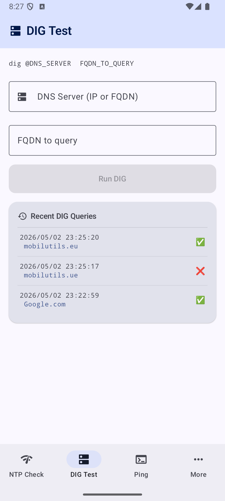
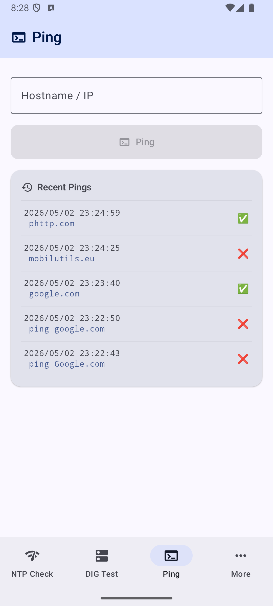
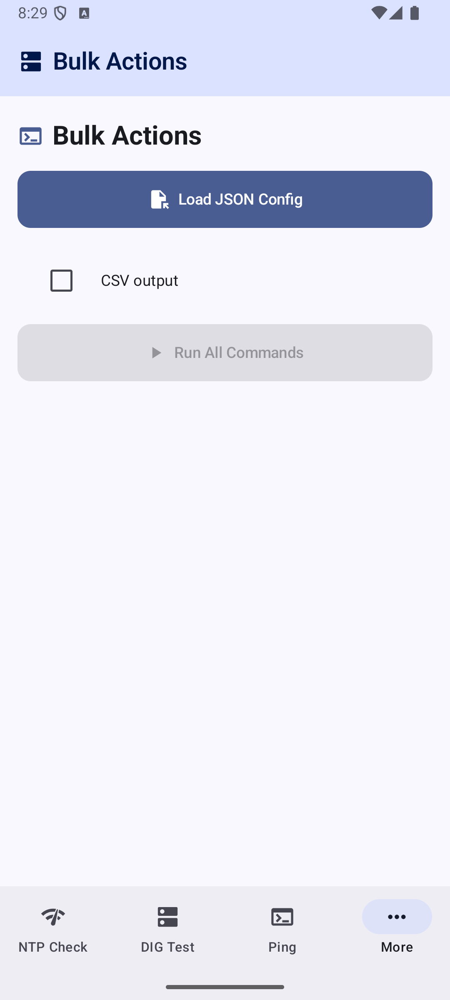
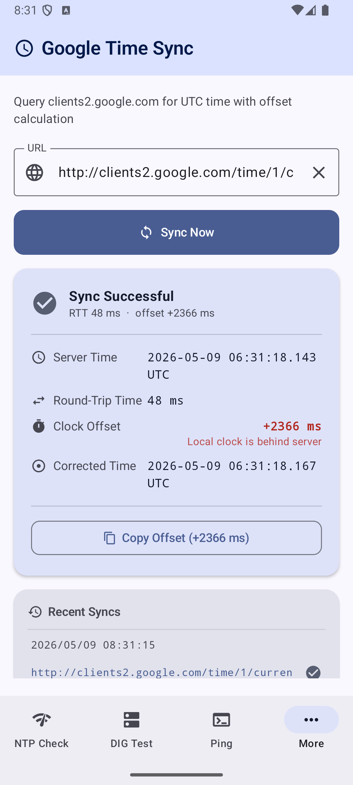
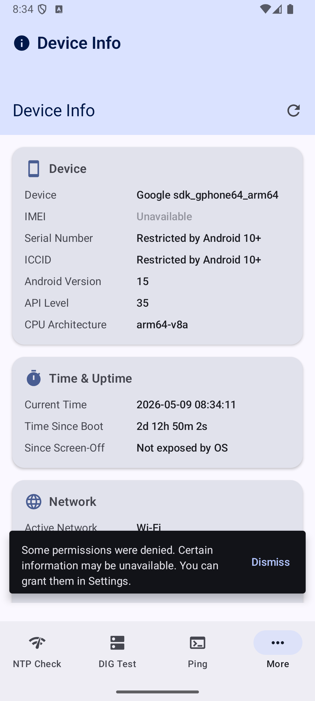

# Network Utilities Checker

<p align="left">
  
</p>

A modern Android app for network diagnostics: **NTP reachability testing**, **DNS lookup (DIG)**, **Ping**, **Traceroute**, **Port Scanner**, **LAN Scanner**, **Google Time Sync**, **HTTPS Certificate Inspector**, and **Bulk Actions** (batch execute commands from a JSON config). Includes a global **Settings** screen with configurable operation timeouts and optional **Proxy PAC** routing.

Github pages : [https://mobilutils.github.io/ntp-dig-ping-more/](https://mobilutils.github.io/ntp-dig-ping-more/)

## Visuals

| NTP Check| DIG | PING |
|---|---|---|
||||
|More menu|Settings|BulkActions|
||||
|TRACEROUTE|Port Scan|LAN Scan|
||||
|Google Timesync|Checkcert|DeviceInfos|
||||

More to Github pages : [Github Pages](https://mobilutils.github.io/ntp-dig-ping-more/available-features/screens)


#### Supported Pseudo-Commands

| Command | Syntax | Description |
|---|---|---|
| `ping` | `ping -c N [-t W] host` | ICMP ping (N packets, -t W = per-packet wait in seconds + coroutine timeout) |
| `dig` | `dig @server fqdn [-t T]` | DNS lookup to custom server (-t T = coroutine timeout in seconds) |
| `ntp` | `ntp [pool] [-t T]` | NTP query (-t T = coroutine timeout in seconds) |
| `port-scan` | `port-scan [-p ports] [-t S] host` | TCP port scan (-t S = connect timeout per port in seconds; ports defaults to 22) |
| `checkcert` | `checkcert -p port [-t T] host` | HTTPS certificate check (-t T = coroutine timeout in seconds) |
| `device-info` | `device-info` | Device identity, network, battery, storage (no -t) |
| `tracert` | `tracert host [-t H]` | TTL-probing traceroute (-t H = max hops, also sets coroutine timeout) |
| `google-timesync` | `google-timesync` | Google time sync (no -t) |
| `lan-scan` | `lan-scan` | LAN subnet device discovery (no -t) |

**Timeout precedence:** per-command `-t` > config-level `"timeout"` > default 30s.

**Proxy PAC override (`url-proxypac`):** An optional global field that specifies a PAC script URL for proxy routing. When set, the HTTP-based pseudo-commands `checkcert` and `google-timesync` route traffic through the proxy resolved by the PAC script. This is independent of the app's Settings proxy configuration and does not modify persisted settings.

```json
{
  "url-proxypac": "http://proxy.corp.com/proxy.pac",
  "output-file": "~/files/results.txt",
  "run": {
    "cert_google": "checkcert -p 443 google.com",
    "timesync":    "google-timesync"
  }
}
```

### 🤖 ADB Automation (headless / CI)

Bulk Actions supports fully automated execution via ADB intent extras — **no user interaction required**.

#### Working commands (API 33+)

On Android 13+ (API 33), `READ_EXTERNAL_STORAGE` is no longer grantable and `file://` URIs pointing to `/sdcard/` always throw `EACCES`. The working approach uses the **app's private directory** and `run-as` for both push and pull:

```bash
APP_ID="io.github.mobilutils.ntp_dig_ping_more"
PRIVATE_DIR="/data/user/0/$APP_ID/files/files"

# 1. Push config (host-side pipe via run-as — avoids shell/sdcard permission issues)
cat notes/config-files_bulk-actions/blkacts_single_ping_success.json \
  | adb shell "run-as $APP_ID sh -c 'cat > $PRIVATE_DIR/blkacts_single_ping_success.json'"

# 2. Launch with auto-load + auto-run
#    IMPORTANT: use --ez (boolean), NOT --es (string) — --es silently fails
adb shell am force-stop "$APP_ID"
adb shell am start \
    -n "$APP_ID/.MainActivity" \
    -d "file://$PRIVATE_DIR/blkacts_single_ping_success.json" \
    --ez auto_run true

# 3. Wait for execution to complete
sleep 60

# 4. Pull results (adb pull cannot read private dir — use run-as cat instead)
adb shell "run-as $APP_ID cat $PRIVATE_DIR/blkacts_single_ping_success.txt" \
  > ./test-results/blkacts_single_ping_success.txt
```

#### Common pitfalls

| Mistake | Symptom | Correct approach |
|---------|---------|-----------------|
| `--es auto_run true` | App loads config but never runs (Android logs: *"expected Boolean but value was String"*) | Use `--ez auto_run true` |
| `adb push ... /sdcard/Download/` + `file:///sdcard/...` | `EACCES (Permission denied)` on SDK 33+ — `READ_EXTERNAL_STORAGE` is no longer grantable | Push to `$PRIVATE_DIR` via `run-as` pipe |
| `adb pull /data/user/0/<pkg>/files/...` | `Permission denied` — `adb` runs as `shell` user | Use `adb shell "run-as <pkg> cat <file>"` and redirect to host |
| `adb shell "run-as <pkg> cp <file> /sdcard/..."` | `Permission denied` — `run-as` cannot write to `/sdcard/` | Use the host-redirect pull approach above |

#### Bundled script (Unix / Linux / macOS)

```bash
# Single config (default emulator)
./BULKACTIONS-ADB-SCRIPT.sh -f blkacts_single_ping_success.json

# Specific emulator
./BULKACTIONS-ADB-SCRIPT.sh -f blkacts_multi_all9_success.json -e Medium_Phone_API_35

# Fully unattended — no interactive prompts at the end
./BULKACTIONS-ADB-SCRIPT.sh -f blkacts_multi_all9_success.json --no-interact

# Show emulator window during run
./BULKACTIONS-ADB-SCRIPT.sh -f blkacts_single_ping_success.json --show-emulator

# Real device mode (skips all emulator commands)
./BULKACTIONS-ADB-SCRIPT.sh -f blkacts_multi_all9_success.json --real-device --no-interact

# Absolute path or tilde-expanded path to config
./BULKACTIONS-ADB-SCRIPT.sh -f ~/Downloads/blkacts_single_ping_success.json --no-interact
```

#### Bundled script (Windows)

```cmd
REM Single config (default emulator)
BULKACTIONS-ADB-SCRIPT-NEW.bat -f blkacts_single_ping_success.json

REM Specific emulator
BULKACTIONS-ADB-SCRIPT-NEW.bat -f blkacts_multi_all9_success.json -e Medium_Phone_API_35

REM Fully unattended — no interactive prompts at the end
BULKACTIONS-ADB-SCRIPT-NEW.bat -f blkacts_multi_all9_success.json --no-interact

REM Show emulator window during run
BULKACTIONS-ADB-SCRIPT-NEW.bat -f blkacts_single_ping_success.json --show-emulator

REM Real device mode (skips all emulator commands)
BULKACTIONS-ADB-SCRIPT-NEW.bat -f blkacts_multi_all9_success.json --real-device --no-interact

REM Path with ~ expanded to %USERPROFILE%
BULKACTIONS-ADB-SCRIPT-NEW.bat -f ~\Downloads\blkacts_single_ping_success.json --no-interact
```

Options (both scripts share the same flags):

| Flag | Description |
|---|---|
| `-f, --filepath <config>` | Config filename (required) |
| `-e, --emulator-name <name>` | AVD name to launch (default: `Medium_Phone_API_35`) |
| `-d, --real-device` | Skip emulator entirely; use connected physical device |
| `-a, --no-interact` | Suppress all prompts (auto-exit after completion) |
| `-s, --show-emulator` | Launch emulator in visible window mode |
| `-h, --help` | Show this help message |

The script handles emulator startup, push, launch, wait for marker file `.running-tasks` to be created, then to be removed, finally pull the resulting file automatically.

See [notes/20260501_BulkActions-ADB-Script-fixed.md](notes/20260501_BulkActions-ADB-Script-fixed.md) for the full root-cause analysis of every fix applied.

---

## 🏢 MDM / Managed Configuration

NTP DIG PING MORE supports **Android Managed Configurations** (App Restrictions),
enabling IT administrators to remotely pre-configure the application via any MDM/EMM platform
(Intune, Jamf, Workspace ONE, Mosyle, Kandji, …).

### Key restriction keys

| Key | Type | What it pre-fills |
|---|---|---|
| `ntp_default_server` | string | NTP server address |
| `ntp_default_port` | string | NTP UDP port |
| `dig_default_server` | string | DNS resolver |
| `dig_default_fqdn` | string | Domain name to query |
| `ping_default_host` | string | Ping target host |
| `port_scanner_default_host` | string | Port scanner host |
| `https_cert_default_host` | string | HTTPS cert host |
| `https_cert_default_port` | string | HTTPS cert port |
| `proxy_enabled` | bool | Enable Proxy PAC |
| `proxy_pac_url` | string | PAC script URL |
| `proxy_logging_enabled` | bool | Enable PAC logging |
| `bulk_actions_json` | string | Inline Bulk Actions JSON (zero file transfer) |
| `bulk_actions_url` | string | URL to fetch Bulk Actions JSON from |
| `bulk_actions_auto_run` | bool | Auto-execute Bulk Actions on launch |

All values are **overridable defaults** — users retain full control.

> **Zero-touch Bulk Actions:** Paste a full JSON payload into `bulk_actions_json` +
> set `bulk_actions_auto_run = true`. The app executes the test sequence on first
> launch without any user interaction — no file transfer to the device required.

📖 Full IT administrator guide: [MDM Managed Configuration Explained](docs/pages/en/mdm-managed-configuration-explained.mdx)  
🛠️ Developer reference: [Managed Configuration (MDM)](docs/pages/en/developers/managed-configuration-(mdm).mdx)

---

## Stack

| Layer | Technology |
|---|---|
| Language | Kotlin |
| UI | Jetpack Compose + Material 3 |
| Architecture | MVVM (ViewModel + StateFlow) |
| Navigation | Jetpack Navigation Compose |
| Concurrency | Kotlin Coroutines (`Dispatchers.IO`) |
| NTP | Apache Commons Net 3.11.1 (`NTPUDPClient`) |
| DNS | dnsjava 3.6.2 (`SimpleResolver`) |
| JS Engine | QuickJS 0.9.2 (`app.cash.quickjs`) — PAC script evaluation |
| Persistence | AndroidX DataStore (history + global settings) |
| Testing | JUnit 4, MockK 1.13, Coroutines Test |
| Min SDK | 26 (Android 8.0) |
| Target SDK | 37 (Android 15) |

## Project Structure

```
app/src/main/java/io/github/mobilutils/ntp_dig_ping_more/
├── MainActivity.kt              # NavHost, bottom navigation bar, NTP screen UI
├── MoreToolsScreen.kt           # Overflow screen: Settings, Traceroute, Port Scanner, etc.
├── NtpRepository.kt             # NTP network I/O (NTPUDPClient, sealed NtpResult)
├── NtpViewModel.kt              # NTP UI state (StateFlow<NtpUiState>), coroutine lifecycle
├── NtpHistoryStore.kt           # DataStore persistence for NTP query history
├── DigScreen.kt                 # DIG test screen composable
├── DigViewModel.kt              # DIG UI state, delegates to DigRepository
├── DigRepository.kt             # DNS resolution via dnsjava SimpleResolver
├── PingScreen.kt                # Ping screen composable
├── PingViewModel.kt             # Ping UI state, process lifecycle, three-state status
├── PingHistoryStore.kt          # DataStore persistence for Ping history
├── TracerouteScreen.kt          # Traceroute screen composable
├── TracerouteViewModel.kt       # TTL-probing traceroute via ping, hop parsing, status
├── TracerouteHistoryStore.kt    # DataStore persistence for Traceroute history
├── PortScannerScreen.kt         # Port Scanner screen composable
├── PortScannerViewModel.kt      # Port Scanner UI state, concurrent scanning logic
├── PortScannerHistoryStore.kt   # DataStore persistence for Port Scanner history
├── LanScannerScreen.kt          # LAN Scanner screen composable
├── LanScannerViewModel.kt       # LAN Scanner UI state, concurrent ping/ARP sweep
├── LanScannerRepository.kt      # Networking logic, subnet detection, ARP parsing
├── LanScannerHistoryStore.kt    # DataStore persistence for LAN Scanner history
├── GoogleTimeSyncRepository.kt  # HTTP fetch, XSSI strip, JSON parse, T1/T4 offset calc
├── GoogleTimeSyncViewModel.kt   # Idle/Loading/Success/Error StateFlow, syncTime() & reset()
├── GoogleTimeSyncScreen.kt      # Google Time Sync screen composable
├── HttpsCertRepository.kt       # TLS handshake, cert extraction, CONNECT tunnel for proxied SSL
├── HttpsCertViewModel.kt        # HTTPS Cert Inspector state, history, fetchCert()
├── HttpsCertScreen.kt           # HTTPS Certificate screen composable
├── HttpsCertHistoryStore.kt     # DataStore persistence for cert inspection history
├── SettingsViewModel.kt         # Settings state: timeout, proxy config, PAC URL validation
├── SettingsScreen.kt            # Settings screen: timeout input, proxy toggle/URL/test
├── settings/
│   ├── SettingsDataStore.kt     # DataStore keys: timeout, proxy_enabled, pac_url, etc.
│   ├── SettingsRepository.kt    # Reactive flows + mutations for all persisted settings
│   └── ProxyConfig.kt           # Data class for proxy PAC configuration
├── proxy/
│   ├── JsEngine.kt              # Interface for PAC script evaluation
│   ├── QuickJsEngine.kt         # QuickJS-based FindProxyForURL evaluator
│   └── ProxyResolver.kt         # PAC fetch, eval, parse, cache, proxy test
├── deviceinfo/
│   ├── DeviceInfoModels.kt      # Data models: DeviceInfo, CertificateInfo, DeviceInfoState
│   ├── SystemInfoRepository.kt  # System API calls: identity, network, battery, storage, MDM, certs
│   ├── DeviceInfoViewModel.kt   # StateFlow<DeviceInfoState>, periodic updates
│   └── DeviceInfoScreen.kt      # Compose UI: Scaffold, LazyColumn, Cards, permission handling
└── ui/theme/                    # Material 3 colors, typography, theme
```

## Requirements

- Android Studio Hedgehog (2023.1.1) or newer
- Android SDK 35 installed
- A device or emulator running Android 8.0+ (API 26+)

## Running the App

### Android Studio

1. Open Android Studio → **File → Open** → select this folder
2. Wait for Gradle sync to complete
3. Connect a device or start an emulator
4. Press **▶ Run**

### Command Line

```bash
# Build and install debug APK
./gradlew installDebug

# Launch on connected device
adb shell am start -n io.github.mobilutils.ntp_dig_ping_more/.MainActivity
```

## Testing

This project includes a unit test suite (365+ tests) covering business logic, ViewModels, proxy resolution, data parsing, and certificate chain display formatting.

```bash
# Run all unit tests
./gradlew test

# Run specific test class
./gradlew testDebugUnitTest --tests "io.github.mobilutils.ntp_dig_ping_more.ProxyResolverTest"
```

See [TESTING.md](TESTING.md) for details.

## Permissions

```xml
<uses-permission android:name="android.permission.INTERNET" />
<uses-permission android:name="android.permission.ACCESS_NETWORK_STATE" />
<uses-permission android:name="android.permission.ACCESS_WIFI_STATE" />
<uses-permission android:name="android.permission.ACCESS_COARSE_LOCATION" />
<uses-permission android:name="android.permission.ACCESS_FINE_LOCATION" />
<uses-permission android:name="android.permission.READ_PHONE_STATE" />
```

`INTERNET`, `ACCESS_NETWORK_STATE`, and `ACCESS_WIFI_STATE` are normal permissions (auto-granted at install). `ACCESS_COARSE_LOCATION`, `ACCESS_FINE_LOCATION`, and `READ_PHONE_STATE` are dangerous permissions requested at runtime via `ActivityResultContracts`. They are needed for Wi-Fi SSID, carrier name, IMEI, ICCID, and serial number.

> **Note:** `android:usesCleartextTraffic="true"` is set in `AndroidManifest.xml` because the Google Time Sync endpoint (`http://clients2.google.com/time/1/current`) is served over plain HTTP. All other features use HTTPS or non-HTTP protocols (UDP/ICMP/TCP sockets).

## Error States

| Error | Cause |
|---|---|
| DNS Failure | Hostname could not be resolved |
| NXDOMAIN | Queried name does not exist |
| Timeout | Server did not respond within the timeout window |
| No Network | Device has no active internet connection |
| HTTP Error | Non-200 response from the Google Time endpoint |
| Parse Error | Response body missing XSSI prefix or invalid JSON |
| Untrusted Chain | TLS certificate chain failed PKIX validation |
| Cert Expired | TLS certificate validity period has lapsed |
| CONNECT Failed | Proxy rejected the HTTP CONNECT tunnel request |
| Error | Any other unexpected exception |

## License

MIT
