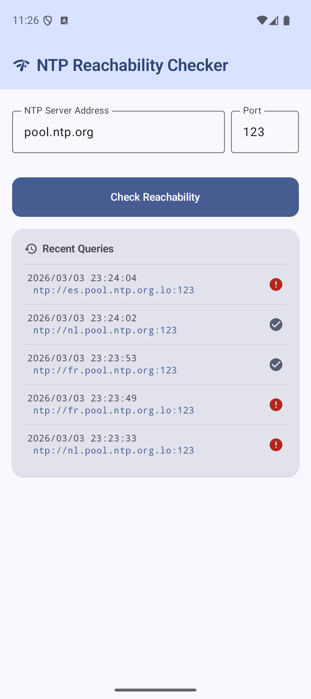
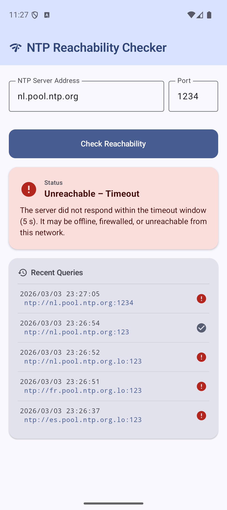
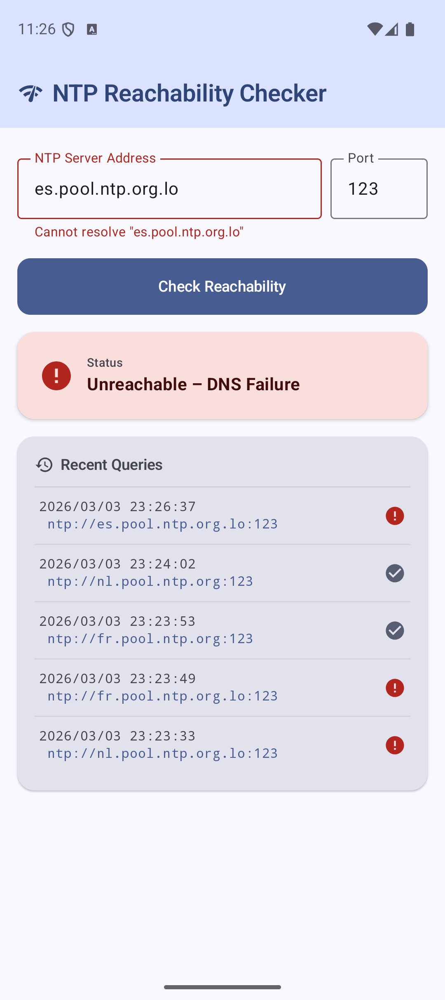

# Network Utilities Checker

A modern Android app for network diagnostics, currently providing **NTP reachability testing** and **DNS lookup (DIG)**.

## Visuals

| Success | DNS Failure | Timeout |
|---|---|---|
||||

## Features

### 🕐 NTP Check
- Enter any NTP server address and port (defaults to `pool.ntp.org:123`)
- Displays:
  - ✅ / ❌ Reachability status
  - 🕒 Server Time
  - ⏱ Clock Offset (ms)
  - 📡 Round-Trip Delay (ms)
- Last 5 queries kept as clickable history (persisted across app restarts)
- Graceful error handling: DNS failure, timeout, no network

### 🔍 DIG Test
- Enter a DNS server (IP or FQDN, e.g. `8.8.8.8`) and a name to resolve
- Query goes directly to the specified DNS server (API 29+), not the system resolver
- Displays a real `dig`-style answer section with aligned columns:

```
;; SERVER: 8.8.8.8

;; QUESTION SECTION:
;www.mobilutils.eu.    IN    A

;; ANSWER SECTION:
www.mobilutils.eu.     10800  IN  CNAME  connect.hostinger.com.
connect.hostinger.com.   120  IN  A      34.120.137.41
```

- Full CNAME chain resolution included
- Graceful error handling: NXDOMAIN, resolver unreachable, no network

## Stack

| Layer | Technology |
|---|---|
| Language | Kotlin |
| UI | Jetpack Compose + Material 3 |
| Architecture | MVVM (ViewModel + StateFlow) |
| Navigation | Jetpack Navigation Compose |
| Concurrency | Kotlin Coroutines (`Dispatchers.IO`) |
| NTP | Apache Commons Net 3.11.1 (`NTPUDPClient`) |
| DNS | dnsjava 3.6.2 (`SimpleResolver`) |
| Persistence | AndroidX DataStore (NTP history) |
| Min SDK | 26 (Android 8.0) |
| Target SDK | 35 (Android 15) |

## Project Structure

```
app/src/main/java/io/github/mobilutils/ntp_dig_ping_more/
├── MainActivity.kt          # NavHost, bottom navigation bar, NTP screen UI
├── NtpRepository.kt         # NTP network I/O (NTPUDPClient, sealed NtpResult)
├── NtpViewModel.kt          # NTP UI state (StateFlow<NtpUiState>), coroutine lifecycle
├── NtpHistoryStore.kt       # DataStore persistence for NTP query history
├── DigScreen.kt             # DIG test screen composable
├── DigViewModel.kt          # DIG UI state, delegates to DigRepository
├── DigRepository.kt         # DNS resolution via dnsjava SimpleResolver
└── ui/theme/                # Material 3 colors, typography, theme
```

## Requirements

- Android Studio Hedgehog (2023.1.1) or newer
- Android SDK 35 installed
- A device or emulator running Android 8.0+ (API 26+)

## Running the App

### Android Studio

1. Open Android Studio → **File → Open** → select this folder
2. Wait for Gradle sync to complete
3. Connect a device or start an emulator
4. Press **▶ Run**

### Command Line

```bash
# Build and install debug APK
./gradlew installDebug

# Launch on connected device
adb shell am start -n io.github.mobilutils.ntp_dig_ping_more/.MainActivity
```

## Permissions

```xml
<uses-permission android:name="android.permission.INTERNET" />
```

Only `INTERNET` is required. No location, storage, or other sensitive permissions are used.

## Error States

| Error | Cause |
|---|---|
| DNS Failure | Hostname could not be resolved |
| NXDOMAIN | Queried name does not exist |
| Timeout | Server did not respond within 5 seconds |
| No Network | Device has no active internet connection |
| Error | Any other unexpected exception |

## License

MIT
