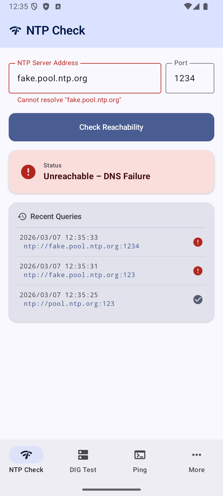
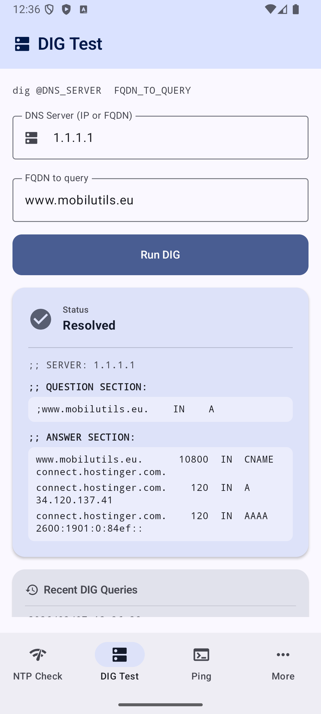
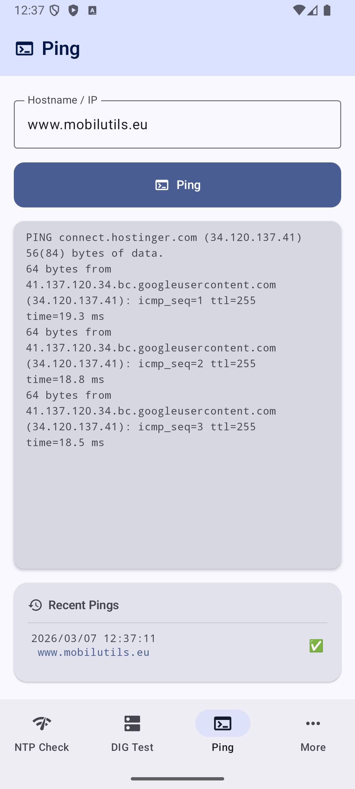
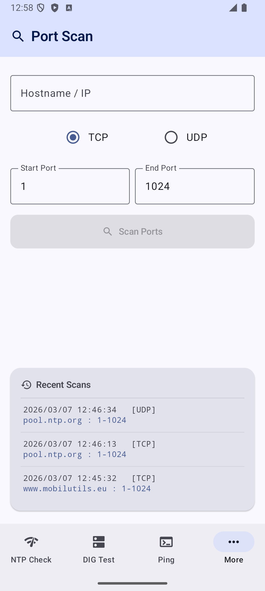
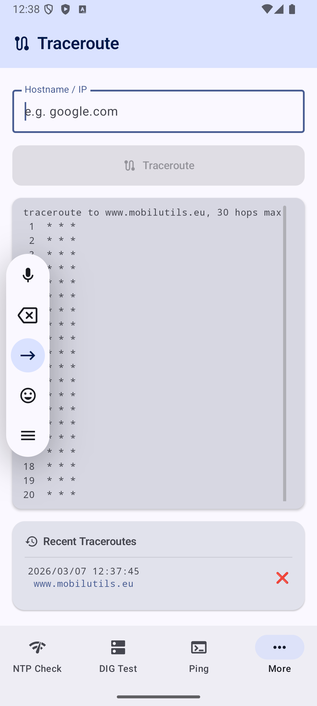
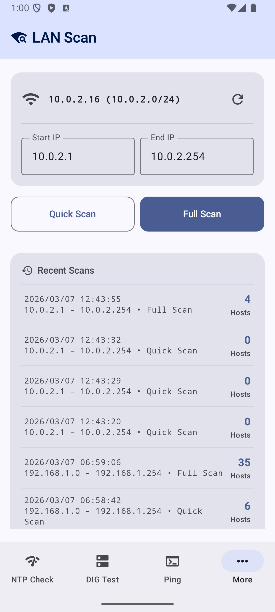
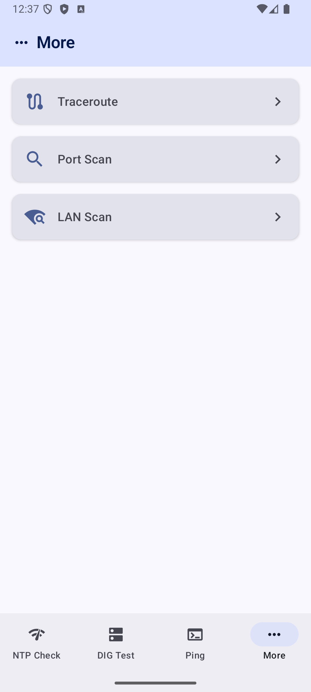

# Network Utilities Checker

A modern Android app for network diagnostics: **NTP reachability testing**, **DNS lookup (DIG)**, **Ping**, **Traceroute**, **Port Scanner**, **LAN Scanner**, **Google Time Sync**, and **Bulk Actions** (batch execute commands from a JSON config).

## Visuals

| NTP Check| DIG | PING |
|---|---|---|
||||
|Port Scanner|Traceroute| |
||| |
| Overlay menu (MORE)| | |
|| | |


## Features

### 🕐 NTP Check
- Enter any NTP server address and port (defaults to `pool.ntp.org:123`)
- Displays:
  - ✅ / ❌ Reachability status
  - 🕒 Server Time
  - ⏱ Clock Offset (ms)
  - 📡 Round-Trip Delay (ms)
- Last 5 queries kept as clickable history (persisted across app restarts)
- Graceful error handling: DNS failure, timeout, no network

### 🔍 DIG Test
- Enter a DNS server (IP or FQDN, e.g. `8.8.8.8`) and a name to resolve
- Query goes directly to the specified DNS server (API 29+), not the system resolver
- Displays a real `dig`-style answer section with aligned columns:

```
;; SERVER: 8.8.8.8

;; QUESTION SECTION:
;www.mobilutils.eu.    IN    A

;; ANSWER SECTION:
www.mobilutils.eu.     10800  IN  CNAME  connect.hostinger.com.
connect.hostinger.com.   120  IN  A      34.120.137.41
```

- Full CNAME chain resolution included
- Graceful error handling: NXDOMAIN, resolver unreachable, no network

### 📡 Ping
- Enter any hostname or IP address
- Tap **Ping** to start — button turns red and becomes **Stop** while running
- Output streams live in a scrolling monospace terminal card
- Sends up to 100 ICMP packets (`ping -c 100`); can be stopped at any time
- History icon reflects the outcome:
  - ✅ All packets went through
  - 🤷‍♂️ At least one succeeded but some were lost
  - ❌ No reply received
- Last 5 pinged hosts kept as clickable history (persisted across app restarts)

### 🛤 Traceroute
- Enter any hostname or IP address
- Tap **Traceroute** to start — button turns red and becomes **Stop** while running
- Output streams live hop-by-hop in a scrolling monospace terminal card
- Implemented via `ping -c 1 -t <TTL>` probing (no `traceroute` binary required)
- Each hop that responds with ICMP Time Exceeded reveals its IP and round-trip time
- Probes up to 30 hops; stops automatically when the destination replies
- History icon reflects the outcome:
  - ✅ Destination reached (all or most hops replied)
  - 🤷‍♂️ Some hops replied but destination not reached
  - ❌ No hop replied at all
- Last 5 traced hosts kept as clickable history (persisted across app restarts)

### 🕵️ Port Scanner
- Check which TCP or UDP ports are open on a specific IP or hostname
- Define custom start and end port ranges
- Select between TCP or UDP scanning protocols
- Live progress bar and dynamically updating list of discovered open ports
- Concurrently scans ports to ensure high performance
- Last 5 scans kept as clickable history (persisted across app restarts)

### 🖥️ LAN Scanner
- Discover active devices on your local Wi-Fi or Ethernet subnet
- Custom scanning ranges with pre-populated values for your current subnet
- Quick Scan (common IPs) or Full Scan (custom range sweep)
- Live list updating with IP, Hostname, MAC address, and latency (ms) for each discovered device
- Tracks scan progress with a stop/cancel capability
- History of past scans persisted across app restarts

### 🌐 Google Time Sync
- Queries `http://clients2.google.com/time/1/current` over HTTP and parses Google's time response
- Strips the `)]}'` XSSI protection prefix before JSON parsing
- Computes full NTP-style time synchronisation metrics:
  - 📡 **RTT** — round-trip time (T4 − T1)
  - ⏱ **Clock Offset** — `correctedServerTime − T4` (positive = local clock behind, negative = ahead)
  - 🧮 **Corrected Server Time** — `serverTime + RTT / 2`
- Color-coded offset indicator: 🟢 < 100 ms · 🟠 < 500 ms · 🔴 ≥ 500 ms
- Custom host field (defaults to `clients2.google.com`)
- One-tap **Copy Offset** button for manual clock-adjustment workflows
- Idle / Loading / Success / Error states survive rotation and config changes

### 📱 Device Info
- Comprehensive read-only view of device identity, network, battery, and security
- Displays: Device Name, IMEI, Serial Number, ICCID, Android Version, API Level, CPU Architecture
- Current Device Time (auto-updating), Time Since Boot, Time Since Screen-Off
- Network: IPv4/IPv6, Subnet Mask, Default Gateway, DNS Servers, NTP Server, Active Network Type
- Wi-Fi SSID, Mobile Carrier/Operator name
- Battery Level, Charging Status, Health
- Total/Available RAM & Internal Storage
- MDM/Device Policy Status (Device Owner, Profile Owner, Managed Profile, or None)
- Installed System & User CA Certificates (subject, validity dates, type)
- Handles Android 10+ API restrictions with clear fallback messages (e.g., "Restricted by Android 10+")
- Runtime permission requests via `ActivityResultContracts`; rationale shown if denied

### ⚡ Bulk Actions
- Load a JSON configuration file defining multiple diagnostic commands to execute in sequence
- Supports built-in command types: `ping`, `dig`, `ntp`, `nmap` (port scan), `checkcert` (HTTPS certificate)
- Unknown command prefixes fall back to raw shell execution
- Each command runs with a 30-second timeout; failures and timeouts are captured per-command without stopping the batch
- Real-time progress bar with command-by-command status (SUCCESS / ERROR / TIMEOUT)
- Terminal-style output with color-coded results
- Auto-saves results to the `"output-file"` path defined in the config after execution (with writability validation)
- **"Validate Config"** button checks JSON structure and output-file writability, suggesting a fallback path if needed
- **"Write to File"** button launches an SAF picker for manual save location selection
- Graceful error handling: invalid JSON, unwritable paths, network failures — all captured and displayed without crashing

## Stack

| Layer | Technology |
|---|---|
| Language | Kotlin |
| UI | Jetpack Compose + Material 3 |
| Architecture | MVVM (ViewModel + StateFlow) |
| Navigation | Jetpack Navigation Compose |
| Concurrency | Kotlin Coroutines (`Dispatchers.IO`) |
| NTP | Apache Commons Net 3.11.1 (`NTPUDPClient`) |
| DNS | dnsjava 3.6.2 (`SimpleResolver`) |
| Persistence | AndroidX DataStore (NTP, Ping & Traceroute history) |
| Testing | JUnit 4, MockK 1.13, Coroutines Test |
| Min SDK | 26 (Android 8.0) |
| Target SDK | 35 (Android 15) |

## Project Structure

```
app/src/main/java/io/github/mobilutils/ntp_dig_ping_more/
├── MainActivity.kt              # NavHost, bottom navigation bar, NTP screen UI
├── MoreToolsScreen.kt           # Overflow screen: Traceroute, Port Scanner, LAN Scanner, Google Time Sync, Device Info
├── NtpRepository.kt             # NTP network I/O (NTPUDPClient, sealed NtpResult)
├── NtpViewModel.kt              # NTP UI state (StateFlow<NtpUiState>), coroutine lifecycle
├── NtpHistoryStore.kt           # DataStore persistence for NTP query history
├── DigScreen.kt                 # DIG test screen composable
├── DigViewModel.kt              # DIG UI state, delegates to DigRepository
├── DigRepository.kt             # DNS resolution via dnsjava SimpleResolver
├── PingScreen.kt                # Ping screen composable
├── PingViewModel.kt             # Ping UI state, process lifecycle, three-state status
├── PingHistoryStore.kt          # DataStore persistence for Ping history
├── TracerouteScreen.kt          # Traceroute screen composable
├── TracerouteViewModel.kt       # TTL-probing traceroute via ping, hop parsing, status
├── TracerouteHistoryStore.kt    # DataStore persistence for Traceroute history
├── PortScannerScreen.kt         # Port Scanner screen composable
├── PortScannerViewModel.kt      # Port Scanner UI state, concurrent scanning logic
├── PortScannerHistoryStore.kt   # DataStore persistence for Port Scanner history
├── LanScannerScreen.kt          # LAN Scanner screen composable
├── LanScannerViewModel.kt       # LAN Scanner UI state, concurrent ping/ARP sweep
├── LanScannerRepository.kt      # Networking logic, subnet detection, ARP parsing
├── LanScannerHistoryStore.kt    # DataStore persistence for LAN Scanner history
├── GoogleTimeSyncRepository.kt  # HTTP fetch, XSSI strip, JSON parse, T1/T4 offset calc
├── GoogleTimeSyncViewModel.kt   # Idle/Loading/Success/Error StateFlow, syncTime() & reset()
├── GoogleTimeSyncScreen.kt      # Google Time Sync screen composable
├── deviceinfo/
│   ├── DeviceInfoModels.kt      # Data models: DeviceInfo, CertificateInfo, DeviceInfoState
│   ├── SystemInfoRepository.kt  # System API calls: identity, network, battery, storage, MDM, certs
│   ├── DeviceInfoViewModel.kt   # StateFlow<DeviceInfoState>, periodic updates
│   └── DeviceInfoScreen.kt      # Compose UI: Scaffold, LazyColumn, Cards, permission handling
└── ui/theme/                    # Material 3 colors, typography, theme
```

## Requirements

- Android Studio Hedgehog (2023.1.1) or newer
- Android SDK 35 installed
- A device or emulator running Android 8.0+ (API 26+)

## Running the App

### Android Studio

1. Open Android Studio → **File → Open** → select this folder
2. Wait for Gradle sync to complete
3. Connect a device or start an emulator
4. Press **▶ Run**

### Command Line

```bash
# Build and install debug APK
./gradlew installDebug

# Launch on connected device
adb shell am start -n io.github.mobilutils.ntp_dig_ping_more/.MainActivity
```

## Testing

This project includes a unit test suite (70+ tests) covering business logic, ViewModels, and data parsing.

```bash
# Run all unit tests
./gradlew test

# Run specific test class
./gradlew test --tests "NtpViewModelTest"
```

See [TESTING.md](TESTING.md) for details.

## Permissions

```xml
<uses-permission android:name="android.permission.INTERNET" />
<uses-permission android:name="android.permission.ACCESS_NETWORK_STATE" />
<uses-permission android:name="android.permission.ACCESS_WIFI_STATE" />
<uses-permission android:name="android.permission.ACCESS_COARSE_LOCATION" />
<uses-permission android:name="android.permission.ACCESS_FINE_LOCATION" />
<uses-permission android:name="android.permission.READ_PHONE_STATE" />
```

`INTERNET`, `ACCESS_NETWORK_STATE`, and `ACCESS_WIFI_STATE` are normal permissions (auto-granted at install). `ACCESS_COARSE_LOCATION`, `ACCESS_FINE_LOCATION`, and `READ_PHONE_STATE` are dangerous permissions requested at runtime via `ActivityResultContracts`. They are needed for Wi-Fi SSID, carrier name, IMEI, ICCID, and serial number.

> **Note:** `android:usesCleartextTraffic="true"` is set in `AndroidManifest.xml` because the Google Time Sync endpoint (`http://clients2.google.com/time/1/current`) is served over plain HTTP. All other features use HTTPS or non-HTTP protocols (UDP/ICMP/TCP sockets).

## Error States

| Error | Cause |
|---|---|
| DNS Failure | Hostname could not be resolved |
| NXDOMAIN | Queried name does not exist |
| Timeout | Server did not respond within the timeout window |
| No Network | Device has no active internet connection |
| HTTP Error | Non-200 response from the Google Time endpoint |
| Parse Error | Response body missing XSSI prefix or invalid JSON |
| Error | Any other unexpected exception |

## License

MIT
